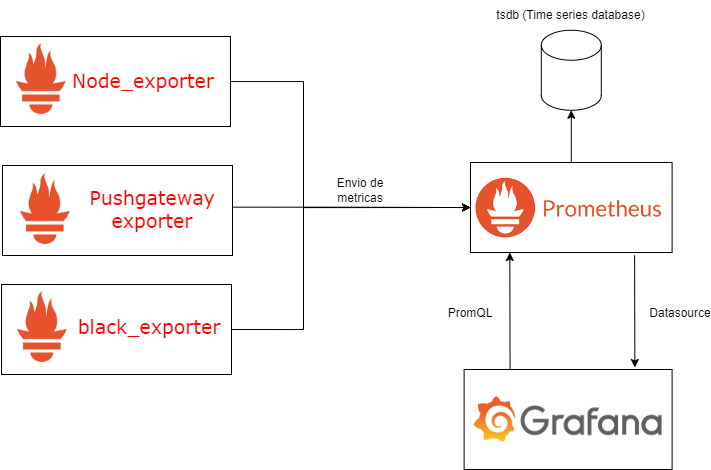

📑 Nota: El Readme explica datos y pasos de configuracion, el archivo stepbystep.docx contiene el paso a paso de todos los comandos sin explicación de los detalles informativos.

## Introducción 📜

Esté proyecto explica la instalación, configuración y explotación de las herramientas como Grafana y Prometheus y exporters que son utilizados para enviar parametros custom(pushgateway) o existentes como node_exporter,black_exporter, etc. Se instalaron 2 maquinas virtuales (VMs 💻), algunas configuraciones solo deben realizarse en una Vm1 💻 y otras en ambas VMs 💻🔛💻 como se muestra en la siguiente tabla.

| Configuración | VM1 | VM2 |
|---------------|-----|-----|
| Tarjeta de red |    ✔️  | ✔️ |
| Puertos |   ✔️   |  ✔️   |
| Grafana |   ✔️   |  ❌   |
| Dashboard |   ✔️   |  ❌   |
| datasource |   ✔️   |  ❌   |
| Node_exporter |   ✔️   |  ✔️   |
| Black_Exporter |   ✔️   |  ❌   |
| Pushgateway |     ✔️ |   ✔️  |
| crontab |   ✔️   |  ✔️   |
| Mongodb |   ✔️   |  ❌   |

Los puertos que deben habilitarse en la firewall del SO corresponden a los siguientes.

| Programa o servicio | Puerto |
|---------------|-----|
| grafana |  3000 | 
| prometheus | 9090 |
| node_exporter | 9100 |
| black_exporter | 9115 |
| pushgateway | 9091 |

### Datos tecnicos de SO 💻

SO: Oracle Linux 5.4.17-2136.329.3.1.el8uek.x86_64 (OracleLinux-R8-U5-x86_64) https://yum.oracle.com/oracle-linux-isos.html <br>
Paquetes de SO: telnet,curl <br>
VirtualBox: V7.0 <br>
Memoria RAM 8gb <br>
Tarjeta de red virtual: Adapter 2 host-only Adapter, Adapter#2 <br>


Configuración de red (SO) 💻

Como se muestra en la siguiente imagen, se debe configurar la tarjeta de red de linux para poder conectar en la red(intranet) entre 2 Vms 💻💻<br>


Una vez aplicada la configuración en las 2 Vms, se debe realizar una prueba de ping en la terminal para validar la comunicación. <br>

Vm1 💻<br>
ping -c 2 192.168.100.2 <br>

Vm2 💻<br>
ping -c 2 192.168.100.4 <br>


### Arquitectura de la solución 

La solución se compone de la siguiente manera, realiza una comunicación mediante puertos de red, la exportación de datos de cada exporter o custom script es enviada al tsdb (time serie-database) en este caso prometheus, grafana consulta o exporta los datos mediante una conexion de datasource del tsdb hacia los dashboard mediante los datasource. 


1-Cluster de servidores

Ya sea una solución stand-alone o en cluster, los servidores tendria dentro los exporter ejecutandose como programas, en este caso seria pushgateway, procesos jobs y node_exporter. <br>

2-Pushgateway 

Actua como un recolector de datos mediante un endpoint, los batch jobs ejecutan el script donde se recolecta datos y son enviados hacia pushgateway, este ultimo envia a prometheus los datos generados. Node_exporter es un proceso que contiene código y librerias que recolecta metricas del SO, estos datos son enviados al prometheus.

3-Prometheus cumple la función de almacenar y mantener las metricas recolectadas de los exporters. Mediante un datasource en grafana tiene acceso a las metricas exportas. El tsdb es una base de datos de serie de tiempo optimizada para programas de tipo IoT (Internet of things) que envia metricas a una alta velocidad, es una base de datos no relacional [Más información](https://prometheus.io/docs/prometheus/latest/storage/)

4-Grafana es un vizualizador de datos mediante dashboard custom o personalizados, mediante el datasource se conecta al prometheus exportando metricas con el uso del lenguaje PromQL.



Node_exporter,Pushgateway junto con los batch jobs y black_exporter envian las metricas al Prometheus que a su vez actua de tsdb, el grafana conecta y extrae las metricas que se visualizan en los dashboard. 

### Instalación y configuración

1-Archivos y permisos <br>
2-Puertos de SO <br>
3-Configuración de prometheus y grafana <br>
4-Activación de exporters, prometheus, grafana <br>
5-Configuración de dashboards <br>

####1-Archivos y permisos

En el directorio donde se guardan los archivos y programas de monitoreo, modificar los permisos de usuario y descargar los programas. Descomprimir los archivos tar.
En este caso se uso el directorio /home/oracle/grafana pero se puede crear un filesystem en la / del SO durante la instalación de linux

Permisos del filesystem

```sh
unmask 022
cd /home/oracle
mkdir grafana
chmod 755 grafana
```

Descarga Grafana
```sh
wget https://dl.grafana.com/oss/release/grafana-10.4.2.linux-amd64.tar.gz
tar -zxvf grafana-10.4.2.linux-amd64.tar.gz
mv grafana-10.4.2.linux-amd64.tar.gz grafana_10_4
```

Descarga Prometheus
```sh
wget https://github.com/prometheus/prometheus/releases/download/v2.51.2/prometheus-2.51.2.linux-amd64.tar.gz
tar -zxvf prometheus-2.51.2.linux-amd64.tar.gz
mv prometheus-2.51.0.linux-amd64 prometheus
```

Descarga Black_exporter
```sh
wget https://github.com/prometheus/blackbox_exporter/releases/download/v0.25.0/blackbox_exporter-0.25.0.linux-amd64.tar.gz
tar -zxvf blackbox_exporter-0.25.0.linux-amd64.tar.gz
mv blackbox_exporter-0.24.0 black_Exporter
```

Descarga Node_exporter
```sh
wget https://github.com/prometheus/node_exporter/releases/download/v1.8.0/node_exporter-1.8.0.linux-amd64.tar.gz
tar -zxvf node_exporter-1.8.0.linux-amd64.tar.gz
mv node_exporter-1.8.0.linux-amd64 node_exporter
```

Descarga Pushgateway
```sh
wget https://github.com/prometheus/pushgateway/releases/download/v1.8.0/pushgateway-1.8.0.linux-amd64.tar.gz
tar -zxvf pushgateway-1.8.0.linux-amd64.tar.gz
mv pushgateway-1.8.0.linux-amd64 pushgateway_exporter
```

####2-Puertos de SO (Linux)

Cada proceso hace uso de un puerto especifico donde se comunican.

```sh
sudo firewall-cmd --permanent --zone=public --add-port=3000/tcp #port-grafana
sudo firewall-cmd --permanent --zone=public --add-port=9090/tcp #port prometheus
sudo firewall-cmd --permanent --zone=public --add-port=9100/tcp #port node_exporter
sudo firewall-cmd --permanent --zone=public --add-port=9115/tcp #port black_exporter
sudo firewall-cmd --permanent --zone=public --add-port=9091/tcp #port pushgateway

firewall-cmd --reload
```

#### 3-Configuración de prometheus

En el archivo prometheus.yml en directorio /home/oracle/grafana/prometheus, agregar los job_name que corresponde a cada exporter, puede cambiar la ip:port de prometheus si lo desea, este es utlizado para acceder mediante el browser. El siguiente ejemplo viene para servidores en cluster, el black_exporter es diferente, se debe especificar los endpoint o url que requiere monitoreo.

```yml
global:
  scrape_interval: 15s # Set the scrape interval to every 15 seconds. Default is every 1 minute.
  evaluation_interval: 15s # Evaluate rules every 15 seconds. The default is every 1 minute.
  # scrape_timeout is set to the global default (10s).

# Alertmanager configuration
alerting:
  alertmanagers:
    - static_configs:
        - targets:
          # - alertmanager:9093

# Load rules once and periodically evaluate them according to the global 'evaluation_interval'.
rule_files:
  # - "first_rules.yml"
  # - "second_rules.yml"

# A scrape configuration containing exactly one endpoint to scrape:
# Here it's Prometheus itself.
scrape_configs:
  # The job name is added as a label job=<job_name> to any timeseries scraped from this config.
  - job_name: "prometheus"

    # metrics_path defaults to '/metrics'
    # scheme defaults to 'http'.

    static_configs:
      - targets: ["192.168.100.2:9090"]  #Colocar la ip donde levanta el servicio

  - job_name: "node_exporter"
    static_configs:
      - targets: ["192.168.100.2:9100","192.168.100.4:9100"] #Colocar la ip donde levanta el servicio

  - job_name: "pushgateway"
    static_configs:
      - targets: ["192.168.100.2:9091","192.168.100.4:9091"] #Colocar la ip donde levanta el servicio

  - job_name: 'blackbox_exporter'
    metrics_path: /probe
    params:
      module: [http_2xx]  # Look for a HTTP 200 response.
    static_configs:
      - targets:
        - http://google.com
        - http://prometheus.io
        - https://prometheus.io
    relabel_configs:
      - source_labels: [_address_]
        target_label: __param_target
      - source_labels: [__param_target]
        target_label: instance
      - target_label: _address_
        replacement: 192.168.100.2:9115  # The blackbox exporter's real hostname:port.
```

<details>

  <summary>📑 Ejemplo de prometheus.yml (Click)</summary>

```yml
global:
  scrape_interval: 15s # Set the scrape interval to every 15 seconds. Default is every 1 minute.
  evaluation_interval: 15s # Evaluate rules every 15 seconds. The default is every 1 minute.
  # scrape_timeout is set to the global default (10s).

# Alertmanager configuration
alerting:
  alertmanagers:
    - static_configs:
        - targets:
          # - alertmanager:9093

# Load rules once and periodically evaluate them according to the global 'evaluation_interval'.
rule_files:
  # - "first_rules.yml"
  # - "second_rules.yml"

# A scrape configuration containing exactly one endpoint to scrape:
# Here it's Prometheus itself.
scrape_configs:
  # The job name is added as a label job=<job_name> to any timeseries scraped from this config.
  - job_name: "prometheus"

    # metrics_path defaults to '/metrics'
    # scheme defaults to 'http'.

    static_configs:
      - targets: ["localhost:9000"]
```
</details>

<details>

  <summary>📑 Ejemplo de Node_exporter standalone - cluster (Click)</summary>

```yml
global:
  scrape_interval: 15s 
  evaluation_interval: 15s

alerting:
  alertmanagers:
    - static_configs:
        - targets:

rule_files:
scrape_configs:
    - job_name: "node_exporter_stand_alone"
    
    static_configs:
      - targets: ["192.168.100.2:9100"]

    - job_name: "node_exporter_cluster"
    
    static_configs:
      - targets: ["192.168.100.2:9100","192.168.100.4:9100"]
```
</details>

<details>

  <summary>📑 Ejemplo Black_Exporter (Click)</summary>

```yml
global:
  scrape_interval: 15s 
  evaluation_interval: 15s

alerting:
  alertmanagers:
    - static_configs:
        - targets:

rule_files:
scrape_configs:
    - job_name: 'blackbox_exporter'
    metrics_path: /probe
    params:
      module: [http_2xx]  # Look for a HTTP 200 response.
    static_configs:
    # Los targets son los endpoint o url que el exporter aplica el monitoreo
      - targets:
        - http://google.com
        - http://prometheus.io
        - https://prometheus.io
    relabel_configs:
      - source_labels: [_address_]
        target_label: __param_target
      - source_labels: [__param_target]
        target_label: instance
      - target_label: _address_
        replacement: 192.168.100.2:9115  # The blackbox exporter's real hostname:port.
```
</details>

Modificar archivo sample.ini

Colocar la ip y puerto donde levanta el grafana. Nota: Si quieres cambiar el puerto agregarlo al firewall del SO. Tambien puedes subirlo en localhost

```sh
cd /home/oracle/grafana/grafana10_4/conf
nano sample.ini
```


#### 4-Activación de exporters, prometheus, grafana

<details>

  <summary>📑 Explicación de comandos y parametros (Click)</summary>

| Prometheus |
| ------------- |
| --web.listen-address - Indica la ip:port donde levanta el programa, permite acceder a la plataforma de prometheus mediante el siguiente link 192.168.100.2:9090/metrics |
| --web.listen-address - Indica la ip:port donde levanta el programa, permite acceder a la plataforma de prometheus mediante el siguiente link 192.168.100.2:9090/metrics |
| --web.enable-remote-write-receiver - Permite recibir metricas externas que se pueden configurar con batcn jobs o scripts. Mediante pushgateway enviamos metricas custom a prometheus que son almacenadas en el tsdb.| 


| Node_exporter |
| ------------- |
|--web.listen-address=192.168.100.2:9100 - Indica la ip:port donde levanta el programa, permite acceder a las metricas que genera node_exporter mediante el siguiente link 192.168.100.2:9100/metrics|

| Black_exporter |
| ------------- |
| --config.file=blackbox.yml - Reglas utilizadas para el analisis y extraccion de metricas de http del endpoint indicado en el prometheus.yml |

| Pushgateway |
| ------------- |
| --web.listen-address=192.168.100.2:9091 - Indica la ip:port donde levanta el programa, permite acceder a las metricas que genera node_exporter mediante el siguiente link 192.168.100.2:9091/metrics|

Cada programa trae parametros propios para configurar, si desea ver la documentacion, aplica el siguiente comando en la terminal de SO Linux.

```sh
./grafana-server --help
./prometheus --help
./node_exporter --help
./black_exporter --help
./pushgateway --help
```


</details>

Utilizar los siguientes comandos

Debe utilizar una terminal nueva para cada uno Ctrl+c cerrar el proceso, si desea dejar el proceso activo utilizar el comando nohup

```sh
# Directorio /home/oracle/grafana/grafana10_4/bin
./grafana-server

# Directorio /home/oracle/grafana/prometheus
./prometheus --web.listen-address=192.168.100.2:9090 --config.file=prometheus.yml --web.enable-remote-write-receiver

# Directorio /home/oracle/grafana/node_exporter
./node_exporter --web.listen-address=192.168.100.2:9100

# Directorio /home/oracle/grafana/black_exporter
./black_exporter --config.file=blackbox.yml

# Directorio /home/oracle/grafana/pushgateway
./pushgateway --web.listen-address=192.168.100.2:9091
```

Con nohup, si desea matar el proceso debe aplicar el comando ps -ef | grep grafana , copiar el PID, aplicar el kill -9 PID. el simbolo & envia los datos a un log nohup.log generado por el comando, si coloca > nombre_log envia los datos generados en el prompt al archivo para validar los registros si se presenta algo problema, puedes ver el archivo en tiempo real tail -f nombre_archivo.

```sh
# Directorio /home/oracle/grafana/grafana10_4/bin
nohup ./grafana-server > grafana.log &

# Directorio /home/oracle/grafana/prometheus
nohup ./prometheus --web.listen-address=192.168.100.2:9090 --config.file=prometheus.yml --web.enable-remote-write-receiver > prometheus.log &

# Directorio /home/oracle/grafana/node_exporter
nohup ./node_exporter --web.listen-address=192.168.100.2:9100 > node_exporter.log &

# Directorio /home/oracle/grafana/black_exporter
nohup ./black_exporter --config.file=blackbox.yml > blackexporter.log &

# Directorio /home/oracle/grafana/pushgateway
nohup ./pushgateway --web.listen-address=192.168.100.2:9091 > pushgateway.log &
```
El resultado seria en siguiente.

-Grafana


-Prometheus


-Node exporter


-Black exporter


-Pushgateway


#### 5-Configuración de dashboards

Ingresar a grafana, 192.168.100.2:3000
exportar los dashboard
crear el de metricas
conectar una base de datos (mongodb sql) AventureWorks2017


IMAGEN

